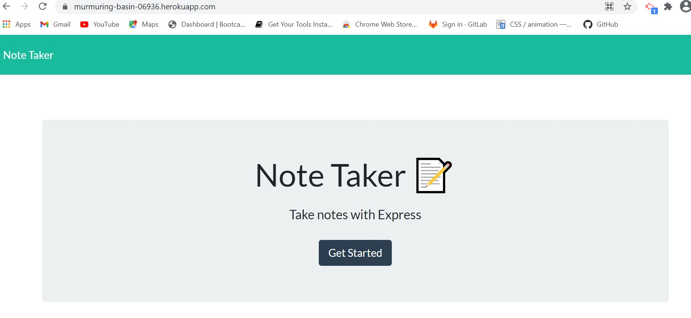
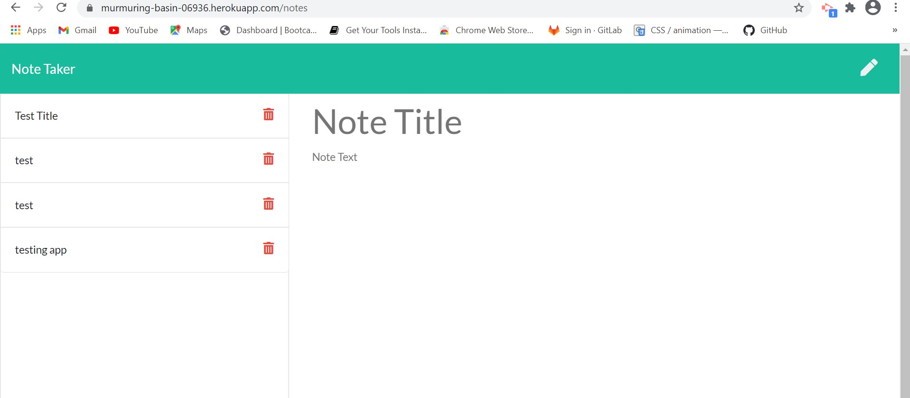

## Project Title
  #Note-Taker
  
  ## Table of Contents

* [Description](#description)
* [Installation](#installation)
* [Usage](#usage)
* [Contribution Guidelines](#contribution-guidelines)
* [License](#license)
* [Questions](#questions)

## Description
AS A small business owner I WANT to be able to write and save notes SO THAT I can organize my thoughts and keep track of tasks I need to complete


## Installation Instructions


You will need node.js installed 
* [Node.js](https://en.wikipedia.org/wiki/Node.js)

To install the required dependencies, please run the following command:

* [inquirer](https://www.npmjs.com/package/inquirer/v/0.2.3)
* [jest](https://www.npmjs.com/package/jest)

```
npm init -y
npm install uniqid

```
## Web Url :

Navigate to : https://murmuring-basin-06936.herokuapp.com/notes

## Usage

Walthrough of adding and deleting notes
[Video](https://drive.google.com/file/d/1qKjRP6FvxJMtav5sCCdJXlP_T28JuUgf/view)

## Mock-up 




## Contribution Guidelines
Link to Contributor's Covenant: https://www.contributor-covenant.org/version/2/0/code_of_conduct/

## License


*This project uses the [MIT](https://spdx.org/licenses/MIT.html) license.*


## Questions
Github Profile : [Creator]:(https://github.com/bhavipatel21)

If you have any questions please email me at bhavij0511@gmail.com
